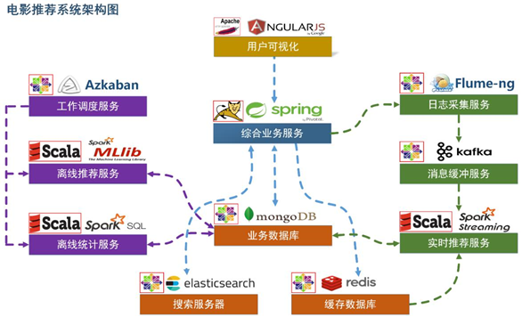
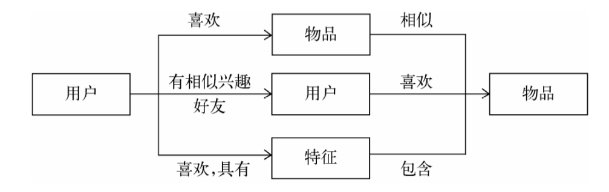

# 电影推荐系统 
### 项目背景
以MoviesLens数据集为依托，以真实网站业务数据架构为基础，包含了离线推荐与实时推荐体系，综合利用了协同过滤算法以及基于内容的推荐方法来提供混合推荐。提供了从前端应用、后台服务、算法设计实现、平台部署等多方位的闭环的业务时实现
### 项目框架  
   
1. 用户可视化:主要负责实现和用户的交互以及业务数据的展示,主体采用AngularJS2进行实现，部署在Apache服务上。
2. 综合业务服务:主要实现JavaEE层面整体的业务逻辑，通过Spring进行构建，对接业务需求。部署在Tomcat上。
3. 业务数据库:采用文档数据库MongoDB,主要负责平台业务逻辑诗句阿存储。
4. 搜索服务器:采用ElasticSearch座位模糊检索服务器,利用匹配查询能力实现基于内容的推荐服务。
5. 缓存数据库:采用Redis作为缓存你数据库，用来支撑实时推荐系统部分对于数据的高速获取需求。

【离线推荐】  
1. 批处理统计性业务采用SparkCore+SparkSQL 进行实现,实现对指标类数据的统计任务。
2. 离线推荐服务:离线推荐业务采用 SparkCore+SparkMLib 进行实现,采用ALS算法进行实现。
3. 工作调度服务:对于离线推荐部分需要以一定的时间频率对算法进行调度,采用Azkaban进行任务调度。

【实时推荐】  
日志采集:   通过利用Flume-ng对业务平台中用户对于电影的一次评分行为进行采集，实时发送到kafka集群。  
消息缓冲服务:项目采用Kafka作为流式数据的缓存组件，接受来自Flume的数据采集请求。并将数据推送到项目的实时推荐系统部分。  
实时推荐服务:项目采用SparkStreaming作为实时推荐系统，通过接收Kafka中缓存的数据,
           通过设计的推荐算法实现对实时推荐的数据处理，并将结构合并更新到MongoDB数据库。   
#### 数据流程  
  
【具体流程如下】
```markdown
【数据初始化】
通过SparkSQL将系统初始花数据加载到MongoDB和ElasticSearch中。
【离线推荐部分】  
 1. 通过Azkaban实现对于离线统计服务以离线推荐服务的调度，通过设定的运行时间完成任务的触发执行。
 2. 离线统计服务从MongoDB中加载数据,将【电影评分统计】、【电影评分个数统计】、【最近电影评分个数统计】三个统计算法进行实现。并将结果会写到MongoDB中;离线推荐服务从MongoDB中加载数据,通过ALS算法分别将【用户推荐结果矩阵】、【影片相似度矩阵】回写到MongoDB中。
【实施推荐部分】  
    Flume从综合业务服务的运行日志中读取日志更新,并将更新的日志实时推送到Kafka中;kafka在收到这些日志之后,通过kafkaStream程序对获取的日志信息进行过滤处理,获取用户评分数据流,并发送一到另外一个kafka队列;sparkStreaming监听kafka队列,实时获取kafka过滤出来的用户评分数据流,融合存储在Redis中的用户最近评分队列数据,提交给实时推荐算法,完成对用户新的推荐结果结果计算;计算完成之后,将新的推荐结果放入MongoDB数据库。
【业务推荐部分】
    推荐结果展示部分,从MongoDB、ElasticSearch中将离线推荐结果、实时推荐结果、内容推荐结果进行混合,综合给出相对应的数据。
    电影信息查询服务通过对接MongoDB实现对电影信息的查询操作。
    电影评分的部分，获取用户通过UI给出的评分动作，后台服务进行数据库记录后，一方面将数据推动到Redis集群中，另一方面,通过预设的日志框架输出到Tomcat中的日志。
    项目通过ElasticSearch实现对电影的模糊检索
    电影标签部分，项目提供用户对电影打标签服务。
```
### 推荐系统简介及算法原理
#### 推荐系统简介  
##### 目的
1. 让用户更快更好的获取到自己需要的内容
2. 让内容更快更好的推送到喜欢它的用户手中
3. 让网站更有效地保留用户资源。  
      
#### 推荐系统的基本思想
1. 利用用户和物品的特征信息,给用户推荐具有用户喜欢的特征的物品。
2. 利用用户喜欢过的物品，给用户推荐与他喜欢过的物品相似的物品。
3. 利用和用户相似的其他用户，给用户推荐那些和他们兴趣爱好相似的其他用户喜欢的物品。
      
#### 推荐系统的数据分析  
1. 要推荐物品或内容的元数据，例如关键字、分类标签、基因描述等。
2. 系统用户的基本信息,例如性别、年龄、兴趣爱好等。
3. 用户的行为数据,可以转化为对物品或者信息的偏好,根据应用本身的不同,可能包括用户对物品的评分,用户查看物品的记录,用户的购买记录等。这些用户的偏好信息可以分为两类:
   1. 显式的用户反馈:这类是用户在网站上自然浏览或者使用网站以外,显式的提供反馈信息,例如用户对物品的评分,或者对物品的评论。
   2. 隐式的用户反馈:这类是用户在使用网站产生的数据,隐式的反应了用户对物品的喜好,例如用户购买了某物品,用户查看了某物品的信息等等。  

### 技术补漏

